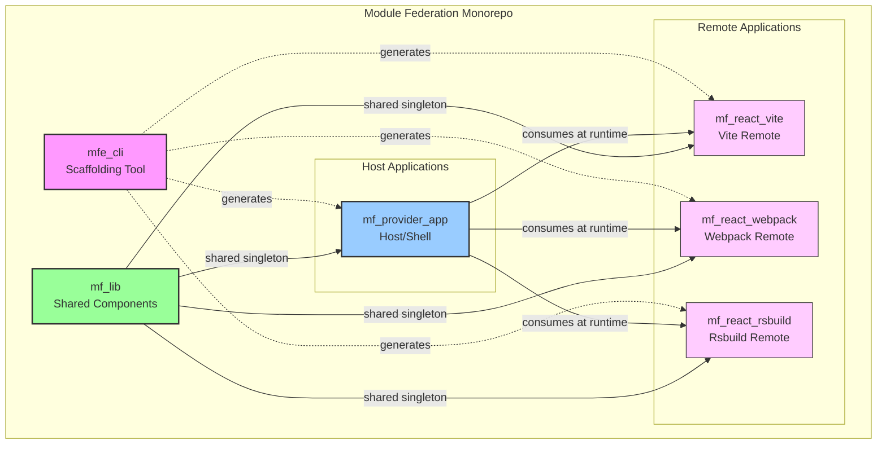
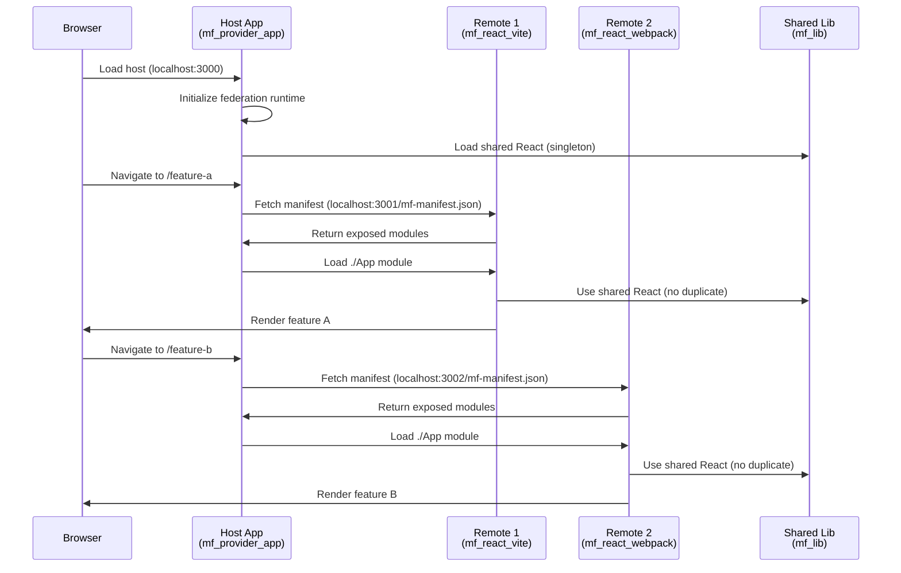
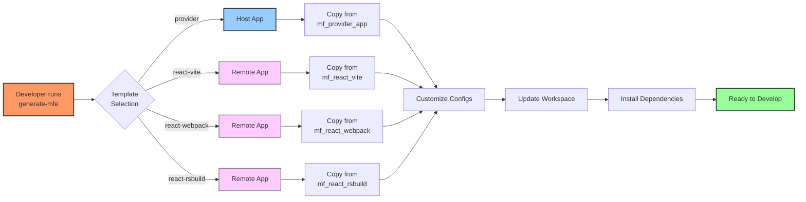
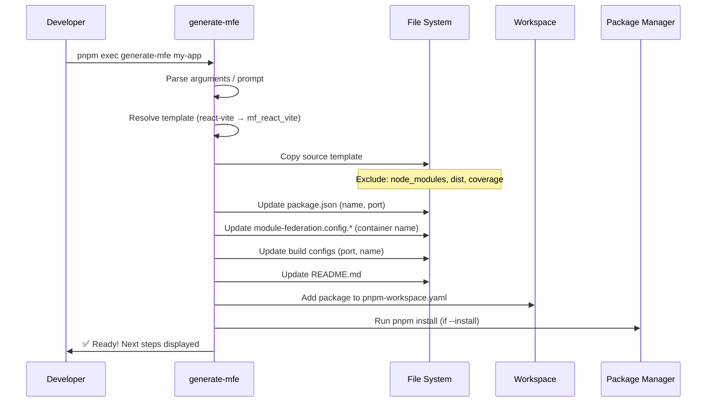
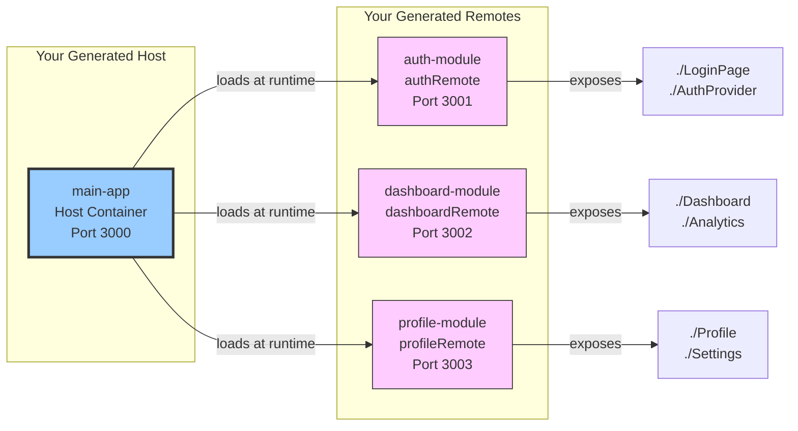
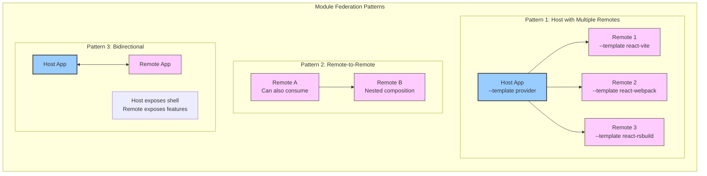
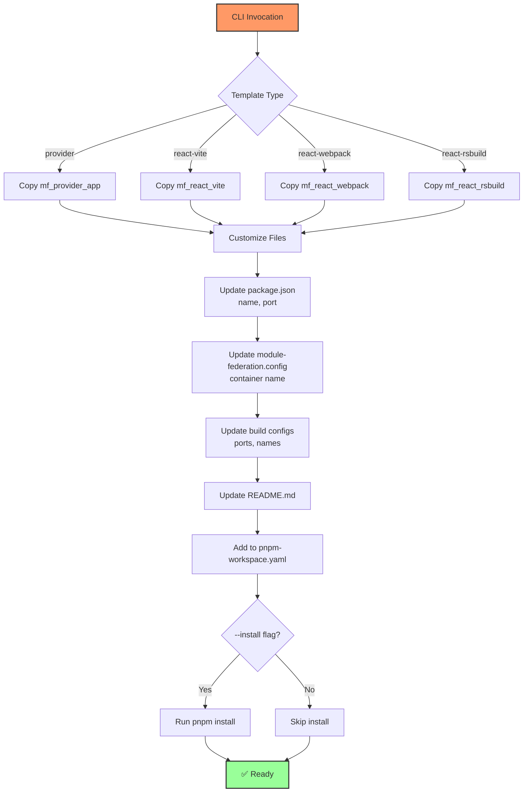
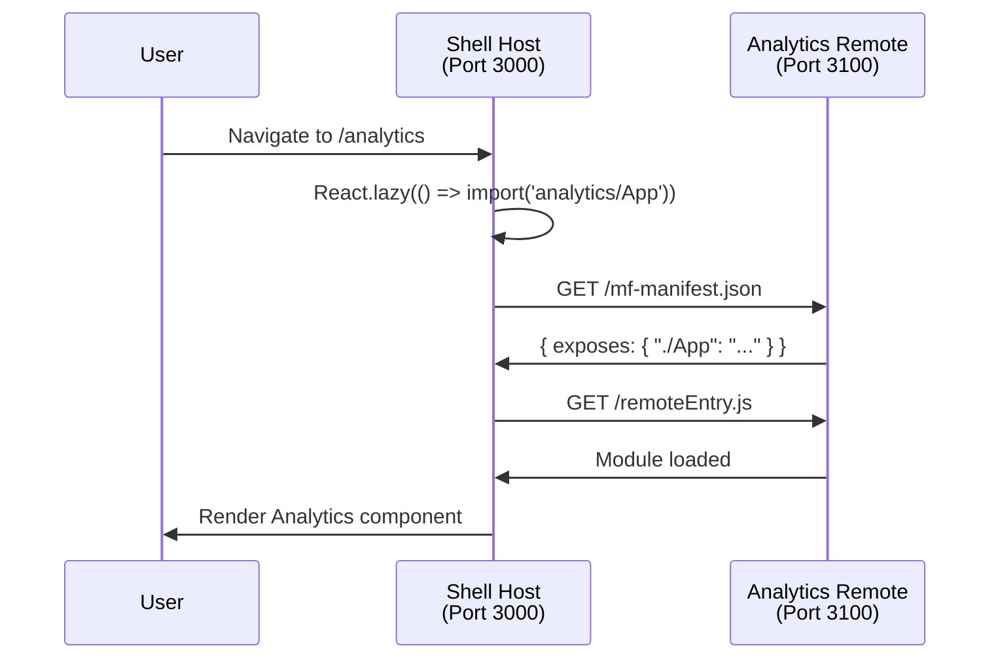
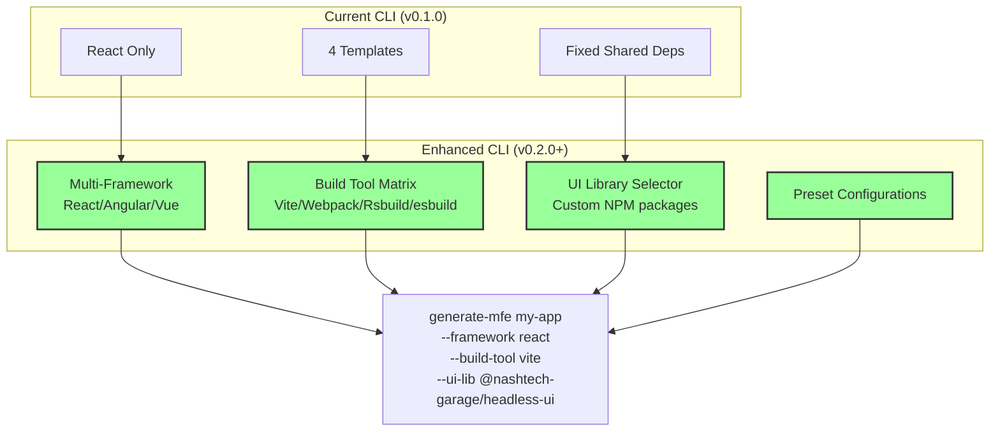
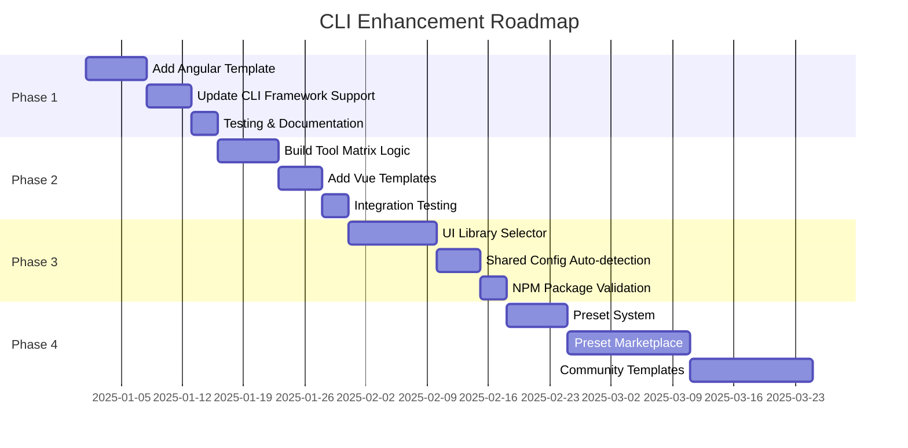

# Module Federation Developer Guide

This guide covers development workflows and best practices for the Module Federation monorepo.

## Prerequisites

- Node.js 18+ (LTS recommended)
- PNPM package manager
- Git
- VS Code (recommended)

| Package            | Purpose                                                     | Build Tool             | Role               |
| ------------------ | ----------------------------------------------------------- | ---------------------- | ------------------ |
| `mf_lib`           | Shared React UI/logic library exposed via Module Federation | Rslib + Rsbuild plugin | **Shared Library** |
| `mf_provider_app`  | Provider/host application (serves manifests for consumers)  | Rsbuild                | **Host**           |
| `mf_react_rsbuild` | Consumer React app using Rsbuild + federation               | Rsbuild                | **Remote**         |
| `mf_react_vite`    | Consumer React app using Vite federation plugin             | Vite                   | **Remote**         |
| `mf_react_webpack` | Consumer React app using Webpack Enhanced MF                | Webpack                | **Remote**         |
| `mfe_cli`          | Scaffolding CLI to generate new MFEs from templates         | Node (TypeScript)      | **Developer Tool** |

Module Federation allows each remote (MFE) to build and deploy independently while sharing code (e.g. `mf_lib`) without bundling duplicates.

### Architecture Overview



---

## 2. Prerequisites

- Node 18+ (LTS recommended)
- PNPM (`npm i -g pnpm`)
- Git

Optional: Chrome DevTools, Storybook familiarity.

---

## 3. Initial Setup

```bash
pnpm install
```

This installs root dev tools plus each package's dependencies. PNPM workspace hoists where possible while preserving isolation.

---

## 4. Running in Development

You can launch different federated compositions depending on target build system.

### 4.1 Start Rsbuild Composition

Starts library (watch) + provider + rsbuild consumer.

```bash
pnpm dev:rsbuild
```

Flow:

1. `mf_lib` runs `mf-dev` (federation-aware build/watch).
2. `mf_provider_app` waits for library manifest and serves its own manifest.
3. `mf_react_rsbuild` starts once manifests are reachable.

### 4.2 Start Vite Composition

```bash
pnpm dev:vite
```

Starts library watch then Vite consumer once manifest available.

### 4.3 Start Webpack Composition

```bash
pnpm dev:webpack
```

### 4.4 Storybook for Shared Library

```bash
pnpm storybook
```

Useful for isolated UI development of `mf_lib`.

---

## 5. Build & Test

```bash
pnpm build:lib      # Build shared lib
pnpm build:vite     # Build Vite consumer
pnpm build:webpack  # Build Webpack consumer
pnpm build:rsbuild  # Build Rsbuild consumer
pnpm build:provider # Build provider app

pnpm test:vite      # Jest/RTL tests in Vite app
pnpm test:webpack   # Jest/RTL tests in Webpack app
```

Type checking & linting examples:

```bash
pnpm typecheck:vite
pnpm lint:vite
pnpm typecheck:webpack
pnpm lint:webpack
```

---

## 6. Project Architecture Deep Dive

### 6.1 Runtime Federation Flow



### 6.2 Federation Manifests

Each build tool writes a manifest describing exposed modules, consumed remotes, and shared dependencies. Startup commands use `wait-on` to ensure manifests are available before launching dependent apps.

**Manifest Structure:**

```json
{
  "name": "dashboardRemote",
  "remotes": [],
  "shared": {
    "react": { "singleton": true, "requiredVersion": "^18.3.1" },
    "react-dom": { "singleton": true, "requiredVersion": "^18.3.1" }
  },
  "exposes": {
    "./App": "./src/App.tsx",
    "./Dashboard": "./src/components/Dashboard.tsx"
  }
}
```

### 6.3 Shared Library (`mf_lib`)

- Built with `rslib` (bundler optimized for libraries) + federation dev mode.
- Exports bundled JS + `.d.ts` types.
- Peer dependencies: `react` / `react-dom` (to avoid duplicate React versions).
- **Singleton Pattern**: Ensures only one React instance across all MFEs.

### 6.4 Provider App (Host)

Acts as a host/root registry. Other MFEs can dynamically load its remote container or manifest. Useful for routing or global shell layout.

**Typical Host Responsibilities:**

- Global navigation / routing
- Authentication context
- Theme provider
- Error boundaries
- Remote orchestration

### 6.5 Consumers/Remotes (Vite / Rsbuild / Webpack)

Demonstrate multi-tool parity while using federation:

- **Vite**: Uses `@module-federation/vite` plugin (fast HMR)
- **Rsbuild**: Uses `@module-federation/rsbuild-plugin` (Rspack powered)
- **Webpack**: Uses `@module-federation/enhanced` (classic, stable)

**Key Difference**: All produce compatible federation manifests, allowing any host to consume any remote regardless of build tool.

---

## 7. Adding a New Micro Frontend (Manual Process)

1. Create folder: `mf_react_<toolname_new>`.
2. Initialize package.json with private + scripts.
3. Add chosen build tool + federation plugin.
4. Configure `module-federation.config.(ts|cjs)` exposing required modules.
5. Add `index.tsx` bootstrap entry.
6. Register new workspace path in `pnpm-workspace.yaml`.
7. Add dev script orchestrating manifest order if it depends on others.
8. Run `pnpm install` and `pnpm dev:<tool>`.

You can now replace steps 1–7 with a single CLI command using the implemented `generate-mfe` tool.

---

## 8. Scaffold CLI – `generate-mfe`

### 8.1 Goals

Provide an opinionated CLI tool to generate new MFEs from existing production-ready boilerplate packages (`mf_react_vite`, `mf_react_webpack`, `mf_react_rsbuild`, `mf_provider_app`). The CLI copies real working templates and customizes them for your new project.

**You can generate both Host and Remote applications:**

- **Host (Shell)**: Use `--template provider` - orchestrates multiple remotes, handles routing
- **Remote (Module)**: Use `--template react-vite|react-webpack|react-rsbuild` - exposes components/pages to hosts

### 8.2 CLI Workflow Diagram



### 8.3 Target Command UX

**Generate a Remote (Consumer):**

```bash
pnpm exec generate-mfe my-dashboard \
  --template react-vite \
  --mf-name dashboardRemote \
  --port 3100 \
  --install
```

**Generate a Host (Shell):**

```bash
pnpm exec generate-mfe my-shell \
  --template provider \
  --mf-name shellHost \
  --port 3000 \
  --install
```

**Interactive mode:**

```bash
pnpm exec generate-mfe
```

### 8.4 Core Options

| Flag         | Description                                 | Example                                                    | Use Case             |
| ------------ | ------------------------------------------- | ---------------------------------------------------------- | -------------------- |
| `--template` | Template key (copies from existing package) | `react-vite`, `react-webpack`, `react-rsbuild`, `provider` | Choose build tool    |
| `--mf-name`  | Module Federation container/remote name     | `--mf-name dashboardRemote` or `--mf-name shellHost`       | Federation identity  |
| `--port`     | Dev server port                             | `--port 3100`                                              | Avoid port conflicts |
| `--shared`   | Comma-separated shared dependencies         | `--shared react,react-dom`                                 | Share libraries      |
| `--install`  | Auto-run `pnpm install` after generation    | `--install`                                                | Quick start          |
| `--force`    | Overwrite existing directory                | `--force`                                                  | Regenerate           |

### 8.5 Template Roles

| Template        | Role       | Typical Use Case                         | MF Pattern                  |
| --------------- | ---------- | ---------------------------------------- | --------------------------- |
| `provider`      | **Host**   | Main shell, routing orchestrator, layout | Consumes multiple remotes   |
| `react-vite`    | **Remote** | Standalone feature module                | Exposes components to hosts |
| `react-webpack` | **Remote** | Standalone feature module                | Exposes components to hosts |
| `react-rsbuild` | **Remote** | Standalone feature module                | Exposes components to hosts |

### 8.6 How It Works

The CLI uses your existing workspace packages as **living templates**:



**Detailed Steps:**

1. **Template Resolution**: Maps template key → existing package

   - `react-vite` → `mf_react_vite` (Remote)
   - `react-webpack` → `mf_react_webpack` (Remote)
   - `react-rsbuild` → `mf_react_rsbuild` (Remote)
   - `provider` → `mf_provider_app` (Host)

2. **Smart Copy**: Copies entire package excluding:

   - `node_modules`, `dist`, `coverage`, `.turbo`, `pnpm-lock.yaml`

3. **Customization**: Updates:

   - `package.json`: name, dev port
   - `module-federation.config.*`: federation container name
   - `vite.config.ts` / `webpack.config.cjs` / `rsbuild.config.ts`: port & name
   - `README.md`: project name

4. **Workspace Integration**: Adds new package to `pnpm-workspace.yaml`

5. **Optional Install**: Runs `pnpm install` if `--install` flag provided

### 8.7 Quick Start Guide

**Example 1: Create a Remote (Dashboard)**

```bash
# First time: build the CLI
pnpm install
pnpm -F mfe-cli build

# Generate a new Vite Remote
pnpm exec generate-mfe analytics-dashboard \
  --template react-vite \
  --mf-name analyticsRemote \
  --port 3200 \
  --install

# Start development
cd analytics-dashboard
pnpm dev
```

**Example 2: Create a Host (Shell Application)**

```bash
# Generate a Host application
pnpm exec generate-mfe corporate-shell \
  --template provider \
  --mf-name corporateHost \
  --port 3000 \
  --install

# Start development
cd corporate-shell
pnpm dev
```

**Example 3: Complete Setup (Host + 2 Remotes)**

```bash
# Build CLI
pnpm -F mfe-cli build

# Create host
pnpm exec generate-mfe main-app --template provider --mf-name mainHost --port 3000 --install

# Create remote 1
pnpm exec generate-mfe auth-module --template react-vite --mf-name authRemote --port 3001 --install

# Create remote 2
pnpm exec generate-mfe dashboard-module --template react-rsbuild --mf-name dashboardRemote --port 3002 --install

# Start all (from root)
pnpm -r --parallel dev
```

### 8.8 Benefits vs Manual Creation

| Manual Process            | With CLI                              |
| ------------------------- | ------------------------------------- |
| ~30 minutes               | ~2 minutes                            |
| 8 manual steps            | 1 command                             |
| Error-prone config        | Validated templates                   |
| Must update 5+ files      | Auto-customized                       |
| Must test if configs work | Templates are working production code |

### 8.9 Host vs Remote Pattern



### 8.10 Maintenance

To improve templates for future generations, simply update the source packages (`mf_react_vite`, etc.). All future CLI generations will use the improved version.

---

## 9. Publishing `mf_lib` to npm

### 9.1 Prepare Version & Tag

Set meaningful version in `mf_lib/package.json`. Use semver: MAJOR for breaking exports, MINOR for new components, PATCH for fixes.

### 9.2 Build

```bash
pnpm build:lib
```

Ensure `dist/` contains `.js` + `.d.ts`.

### 9.3 Peer Dependencies

Keep `react` & `react-dom` as peers. Consumers must install them explicitly to avoid duplication across MFEs.

### 9.4 Auth & Publish

```bash
cd mf_lib
npm login
npm publish --access public
```

Optional: Add `.npmrc` with `//registry.npmjs.org/:_authToken=${NPM_TOKEN}` in CI pipeline.

### 9.5 Consumption

Consumers add dependency:

```bash
pnpm add mf_lib@^x.y.z
```

Then in federated config mark it as shared (or rely on automatic share plugins).

---

## 10. Recommended Branch / Release Workflow

1. Feature branches per MFE or library change.
2. PR triggers build + test matrix (tool variants).
3. Tag release: `lib-v1.2.0`.
4. Automated publish via GitHub Action using `changesets` (future improvement recommendation).

---

## 11. Coding Standards

- TypeScript strict mode recommended.
- Keep React components small & typed (prefer FC generics for props).
- Use Storybook for complex UI before integrating remotely.
- Avoid deep relative imports; prefer barrel `index.ts` exports.

Testing:

- Jest + React Testing Library for components.
- Snapshot testing only for stable presentational pieces.

---

## 12. Future Enhancements

| Area          | Idea                                                  |
| ------------- | ----------------------------------------------------- |
| CLI           | Add `--with-storybook`, `--with-e2e=playwright` flags |
| Library       | Introduce design tokens + theming system              |
| Observability | Add remote load diagnostics overlay                   |
| Performance   | Automatic chunk size report per build tool            |
| Deploy        | Provide example CI pipelines (GitHub Actions)         |

---

## 13. Troubleshooting

| Issue                | Cause                    | Fix                                                  |
| -------------------- | ------------------------ | ---------------------------------------------------- |
| Remote not loading   | Manifest not ready       | Increase wait-on timeout / check port                |
| React hooks mismatch | Duplicate React versions | Ensure single React in lockfile; mark as shared peer |
| Types missing        | Build skipped            | Run `pnpm build:lib` then re-open editor             |
| Vite HMR fails       | Federation plugin reset  | Restart dev server; check plugin config              |

---

## 14. Example Manual Federation Config Tokens

Common fields to parameterize via CLI:

```ts
export default {
  name: '__MF_NAME__',
  exposes: {
    './App': './src/App.tsx',
  },
  shared: ['react', 'react-dom'],
};
```

---

## 15. Security & Dependency Hygiene

- Pin critical tooling versions for reproducibility.
- Periodically run: `pnpm audit --prod` (CI).
- Avoid exposing secrets through env federation; prefer runtime fetch of secure config.

---

## 16. Using the CLI in Practice

### 16.1 Understanding Host vs Remote



**When to use `--template provider` (Host):**

- ✅ Main application shell
- ✅ Root routing container
- ✅ Global state/auth provider
- ✅ Layout orchestrator

**When to use `--template react-vite|webpack|rsbuild` (Remote):**

- ✅ Feature modules (auth, dashboard, settings)
- ✅ Standalone micro apps
- ✅ Team-owned domains
- ✅ Independently deployable units

### 16.2 Generate Your First MFE

```bash
# Build the CLI first time
pnpm install
pnpm -F mfe-cli build

# Generate a new analytics MFE
pnpm exec generate-mfe analytics \
  --template react-vite \
  --mf-name analyticsRemote \
  --port 3200 \
  --install

# Start it
cd analytics
pnpm dev
```

### 16.3 What Happens During Generation



**Step-by-Step Breakdown:**

1. ✅ Copies all files from source template (e.g., `mf_react_vite`)
2. ✅ Excludes: `node_modules`, `dist`, `coverage`, `.turbo`, lock files
3. ✅ Updates `package.json` with new name and port-specific scripts
4. ✅ Updates `module-federation.config.*` with your container name
5. ✅ Updates build configs with custom port
6. ✅ Adds package to `pnpm-workspace.yaml`
7. ✅ Runs `pnpm install` if `--install` flag provided
8. ✅ Shows next steps

### 16.4 Integration with Existing Apps

#### Connecting a Host to a Remote

After generating a host and a remote, wire them together:

**Step 1: Generate both apps**

```bash
# Generate host
pnpm exec generate-mfe shell --template provider --mf-name shellHost --port 3000 --install

# Generate remote
pnpm exec generate-mfe analytics --template react-vite --mf-name analyticsRemote --port 3100 --install
```

**Step 2: Update host's federation config**
In `shell/module-federation.config.ts`:

```ts
export default {
  name: 'shellHost',
  remotes: {
    analytics: 'analyticsRemote@http://localhost:3100/mf-manifest.json',
  },
  shared: ['react', 'react-dom'],
};
```

**Step 3: Import and use in host**
In `shell/src/App.tsx`:

```tsx
import React from 'react';
const AnalyticsApp = React.lazy(() => import('analytics/App'));

function App() {
  return (
    <div>
      <nav>Shell Navigation</nav>
      <React.Suspense fallback="Loading Analytics...">
        <AnalyticsApp />
      </React.Suspense>
    </div>
  );
}
```

**Step 4: Start both and verify**

```bash
# Terminal 1 - Start remote
cd analytics
pnpm dev

# Terminal 2 - Start host
cd shell
pnpm dev
```

Open browser at `http://localhost:3000` - analytics remote loads dynamically!

#### Runtime Module Resolution



---

## 17. Contributing

- Keep templates minimal but production ready.
- Document any new template along with required build flags.
- Add tests for CLI argument parsing & YAML workspace mutation.

---

## 18. CLI Optimization Roadmap

### 18.1 Current State vs Future Vision



### 18.2 Enhancement Plan

#### Phase 1: Framework Support (Angular, Vue, Svelte)
**Goal**: Support multiple frontend frameworks beyond React

**Implementation Steps**:
1. **Add Framework Templates**: Create base templates for each framework
   ```
   mf_angular_webpack/
   mf_vue_vite/
   mf_svelte_vite/
   ```

2. **Update CLI Arguments**:
   ```bash
   pnpm exec generate-mfe my-app \
     --framework angular \
     --build-tool webpack \
     --mf-name myAngularRemote \
     --port 3100
   ```

3. **Template Matrix**:
   | Framework | Vite | Webpack | Rsbuild | esbuild |
   |-----------|------|---------|---------|---------|
   | React | ✅ | ✅ | ✅ | 🔄 |
   | Angular | ❌ | 🔄 | ❌ | ❌ |
   | Vue | 🔄 | 🔄 | 🔄 | ❌ |
   | Svelte | 🔄 | ❌ | ❌ | ❌ |

4. **Code Changes Required**:
   - Update `TEMPLATE_SOURCE_MAP` to handle framework + build tool combinations
   - Add framework-specific dependency injection logic
   - Create framework detection for shared libraries

#### Phase 2: Build Tool Matrix
**Goal**: Allow any framework to work with any compatible build tool

**Implementation**:
```typescript
// mfe_cli/src/templates.ts - Enhanced mapping
const TEMPLATE_SOURCE_MAP: Record<string, Record<string, string>> = {
  react: {
    vite: 'mf_react_vite',
    webpack: 'mf_react_webpack',
    rsbuild: 'mf_react_rsbuild',
    esbuild: 'mf_react_esbuild' // future
  },
  angular: {
    webpack: 'mf_angular_webpack',
    esbuild: 'mf_angular_esbuild'
  },
  vue: {
    vite: 'mf_vue_vite',
    webpack: 'mf_vue_webpack'
  }
};

// Resolve template dynamically
function resolveTemplate(framework: string, buildTool: string): string {
  const template = TEMPLATE_SOURCE_MAP[framework]?.[buildTool];
  if (!template) {
    throw new Error(`No template for ${framework} + ${buildTool}`);
  }
  return template;
}
```

#### Phase 3: UI Library Selector
**Goal**: Allow developers to choose custom UI libraries from NPM

**Usage**:
```bash
# Option 1: NPM package
pnpm exec generate-mfe dashboard \
  --framework react \
  --build-tool vite \
  --ui-lib @nashtech-garage/headless-ui@^0.0.1 \
  --ui-lib @radix-ui/react-select@^2.0.0

# Option 2: Local workspace package
pnpm exec generate-mfe dashboard \
  --framework react \
  --build-tool vite \
  --ui-lib workspace:mf_lib
```

**Implementation**:
```typescript
// mfe_cli/src/ui-libraries.ts
interface UILibrary {
  name: string;
  version: string;
  peerDependencies?: string[];
  federationShared?: boolean;
}

async function addUILibrary(
  targetDir: string, 
  libs: string[]
): Promise<void> {
  const pkgPath = path.join(targetDir, 'package.json');
  const pkg = await fs.readJson(pkgPath);
  
  for (const lib of libs) {
    const [name, version = 'latest'] = lib.split('@');
    
    // Add to dependencies
    pkg.dependencies = pkg.dependencies || {};
    pkg.dependencies[name] = version;
    
    console.log(chalk.cyan(`  📦 Added ${name}@${version}`));
  }
  
  await fs.writeJson(pkgPath, pkg, { spaces: 2 });
}

// Update federation config to share UI libs
async function configureSharedUILibs(
  targetDir: string,
  libs: string[]
): Promise<void> {
  const configPath = path.join(targetDir, 'module-federation.config.ts');
  if (!await fs.pathExists(configPath)) return;
  
  let content = await fs.readFile(configPath, 'utf8');
  
  // Parse shared array and add new libs
  const libNames = libs.map(l => l.split('@')[0]);
  const sharedEntries = libNames.map(lib => 
    `    '${lib}': { singleton: true, requiredVersion: false }`
  ).join(',\n');
  
  // Inject into shared config
  content = content.replace(
    /(shared:\s*\[)/,
    `$1\n${sharedEntries},`
  );
  
  await fs.writeFile(configPath, content, 'utf8');
  console.log(chalk.green(`  ✓ Configured ${libNames.length} shared UI libs`));
}
```

#### Phase 4: Preset Configurations
**Goal**: Provide opinionated presets for common use cases

**Preset Examples**:
```typescript
// mfe_cli/src/presets.ts
export const PRESETS = {
  'nashtech-react': {
    framework: 'react',
    buildTool: 'vite',
    uiLibs: ['@nashtech-garage/headless-ui@^0.0.1'],
    shared: ['react', 'react-dom', '@nashtech-garage/headless-ui'],
    storybook: true,
    testing: 'vitest'
  },
  'enterprise-angular': {
    framework: 'angular',
    buildTool: 'webpack',
    uiLibs: ['@angular/material@^17.0.0'],
    shared: ['@angular/core', '@angular/common'],
    testing: 'jest'
  },
  'minimal': {
    framework: 'react',
    buildTool: 'vite',
    uiLibs: [],
    shared: ['react', 'react-dom'],
    storybook: false
  }
};

// Usage
// pnpm exec generate-mfe my-app --preset nashtech-react --port 3100
```

### 18.3 Enhanced CLI Interface

**Interactive Mode with Framework Selection**:
```typescript
// mfe_cli/src/index.ts - Enhanced prompts
const answers = await inquirer.prompt([
  {
    name: 'framework',
    message: 'Select framework:',
    type: 'list',
    choices: ['react', 'angular', 'vue', 'svelte']
  },
  {
    name: 'buildTool',
    message: 'Select build tool:',
    type: 'list',
    choices: (answers) => {
      // Dynamic choices based on framework
      const tools = {
        react: ['vite', 'webpack', 'rsbuild'],
        angular: ['webpack', 'esbuild'],
        vue: ['vite', 'webpack'],
        svelte: ['vite']
      };
      return tools[answers.framework] || [];
    }
  },
  {
    name: 'uiLibs',
    message: 'Select UI libraries (space to select):',
    type: 'checkbox',
    choices: [
      { name: '@nashtech-garage/headless-ui (v0.0.1)', value: '@nashtech-garage/headless-ui@^0.0.1' },
      { name: '@radix-ui/themes', value: '@radix-ui/themes@^3.0.0' },
      { name: 'antd', value: 'antd@^5.0.0' },
      { name: 'Custom (enter manually)', value: '__custom__' }
    ]
  },
  {
    name: 'customUILib',
    message: 'Enter custom UI library (package@version):',
    when: (answers) => answers.uiLibs.includes('__custom__'),
    validate: (input) => {
      return /^[@\w-]+\/[@\w-]+(@[\d.^~]+)?$/.test(input) || 
             'Invalid format. Use: @scope/package@version';
    }
  }
]);
```

### 18.4 Migration Guide for Existing Templates

**Step 1: Add Angular Template**
```bash
# Create new Angular MFE template
cd module-federation
mkdir mf_angular_webpack

# Initialize Angular project with Module Federation
npx @angular/cli new mf_angular_webpack --routing --style=scss
cd mf_angular_webpack
npm install @angular-architects/module-federation webpack-cli --save-dev

# Configure module federation
npx ng add @angular-architects/module-federation --project mf_angular_webpack --port 4201
```

**Step 2: Update Template Map**
```typescript
// mfe_cli/src/templates.ts
const TEMPLATE_SOURCE_MAP: Record<string, Record<string, string>> = {
  react: {
    vite: 'mf_react_vite',
    webpack: 'mf_react_webpack',
    rsbuild: 'mf_react_rsbuild'
  },
  angular: {
    webpack: 'mf_angular_webpack' // ✅ New template
  }
};
```

**Step 3: Add Framework-Specific Logic**
```typescript
// mfe_cli/src/framework-handlers.ts
export interface FrameworkHandler {
  updateConfig(opts: CreateOptions): Promise<void>;
  getDefaultShared(): string[];
  getDefaultPort(): number;
}

export const FRAMEWORK_HANDLERS: Record<string, FrameworkHandler> = {
  react: {
    async updateConfig(opts) {
      // React-specific config updates
      await updateFederationConfig(opts);
    },
    getDefaultShared: () => ['react', 'react-dom'],
    getDefaultPort: () => 3000
  },
  angular: {
    async updateConfig(opts) {
      // Update angular.json
      const angularJson = path.join(opts.targetDir, 'angular.json');
      if (await fs.pathExists(angularJson)) {
        const config = await fs.readJson(angularJson);
        config.projects[opts.name].architect.serve.options.port = opts.port;
        await fs.writeJson(angularJson, config, { spaces: 2 });
      }
      
      // Update webpack.config.js for MF
      const webpackConfig = path.join(opts.targetDir, 'webpack.config.js');
      if (await fs.pathExists(webpackConfig)) {
        let content = await fs.readFile(webpackConfig, 'utf8');
        content = content.replace(/name:\s*['"][\w_-]+['"]/, `name: '${opts.mfName}'`);
        await fs.writeFile(webpackConfig, content, 'utf8');
      }
    },
    getDefaultShared: () => ['@angular/core', '@angular/common', '@angular/router'],
    getDefaultPort: () => 4200
  }
};
```

### 18.5 Testing Strategy for Multi-Framework CLI

**Test Matrix**:
```typescript
// mfe_cli/__tests__/integration.test.ts
describe('CLI Template Generation', () => {
  test.each([
    ['react', 'vite'],
    ['react', 'webpack'],
    ['react', 'rsbuild'],
    ['angular', 'webpack'],
    ['vue', 'vite']
  ])('generates %s + %s template', async (framework, buildTool) => {
    const result = await execCLI([
      'test-app',
      '--framework', framework,
      '--build-tool', buildTool,
      '--mf-name', 'testRemote',
      '--port', '3999'
    ]);
    
    expect(result.exitCode).toBe(0);
    expect(fs.existsSync(`test-app/package.json`)).toBe(true);
  });
  
  test('adds UI libraries correctly', async () => {
    await execCLI([
      'ui-test',
      '--framework', 'react',
      '--build-tool', 'vite',
      '--ui-lib', '@nashtech-garage/headless-ui@^0.0.1',
      '--ui-lib', '@radix-ui/themes@^3.0.0'
    ]);
    
    const pkg = await fs.readJson('ui-test/package.json');
    expect(pkg.dependencies['@nashtech-garage/headless-ui']).toBe('^0.0.1');
    expect(pkg.dependencies['@radix-ui/themes']).toBe('^3.0.0');
  });
});
```

### 18.6 Documentation Requirements

**Update mfe_cli/README.md**:
```markdown
## Advanced Usage

### Multi-Framework Support
```bash
# React + Vite
pnpm exec generate-mfe react-app --framework react --build-tool vite

# Angular + Webpack
pnpm exec generate-mfe ng-app --framework angular --build-tool webpack

# Vue + Vite
pnpm exec generate-mfe vue-app --framework vue --build-tool vite
```

### Custom UI Libraries
```bash
# Add NashTech Headless UI
pnpm exec generate-mfe my-app \
  --framework react \
  --build-tool vite \
  --ui-lib @nashtech-garage/headless-ui@^0.0.1 \
  --mf-name myRemote \
  --port 3100

# Multiple UI libraries
pnpm exec generate-mfe my-app \
  --framework react \
  --ui-lib @nashtech-garage/headless-ui@^0.0.1 \
  --ui-lib @radix-ui/themes@^3.0.0 \
  --ui-lib antd@^5.0.0
```

### Presets
```bash
# Use NashTech React preset
pnpm exec generate-mfe corporate-dashboard --preset nashtech-react

# Use minimal preset
pnpm exec generate-mfe micro-widget --preset minimal
```
```

### 18.7 Implementation Priority



**Priority Ranking**:
1. **High Priority** (Immediate - v0.2.0):
   - UI Library selector (`--ui-lib` flag)
   - Framework support (Angular)
   - Enhanced interactive prompts

2. **Medium Priority** (Next quarter - v0.3.0):
   - Build tool matrix
   - Vue/Svelte templates
   - Preset system

3. **Low Priority** (Future - v0.4.0+):
   - Preset marketplace
   - Community template registry
   - Visual template builder

### 18.8 Action Items for Developers

**To implement UI library selector TODAY**:

1. **Update CLI arguments**:
   ```typescript
   // mfe_cli/src/index.ts
   .option('ui-lib', { 
     type: 'array', 
     describe: 'UI libraries to include (package@version)',
     default: []
   })
   ```

2. **Create UI library handler**:
   ```bash
   touch mfe_cli/src/ui-libraries.ts
   # Implement addUILibrary() and configureSharedUILibs()
   ```

3. **Update package.json customization**:
   ```typescript
   // In templates.ts after updatePackageJson()
   if (opts.uiLibs && opts.uiLibs.length > 0) {
     await addUILibrary(opts.targetDir, opts.uiLibs);
     await configureSharedUILibs(opts.targetDir, opts.uiLibs);
   }
   ```

4. **Test with your NashTech UI**:
   ```bash
   pnpm -F mfe-cli build
   pnpm exec generate-mfe test-headless \
     --template react-vite \
     --ui-lib @nashtech-garage/headless-ui@^0.0.1 \
     --mf-name testRemote \
     --port 3500 \
     --install
   ```

---

## 19. Summary

This guide provides a repeatable workflow for federated React MFEs using multiple build tools. The `generate-mfe` CLI reduces friction and standardizes new remote creation. Future enhancements will support multiple frameworks (Angular, Vue), build tool matrices, custom UI library selection, and preset configurations for enterprise use cases.

---

**Next Steps**: 
- ✅ **Phase 1 Complete**: UI library selector implemented
- ⬜ Implement Phase 2 (Angular/Vue support) - Est. 2 weeks
- ⬜ Test UI library selector with @nashtech-garage/headless-ui - Est. 1 day
- ⬜ Create NashTech preset with `@nashtech-garage/headless-ui` - Est. 3 days

**New Files Created**:
- `mfe_cli/src/ui-libraries.ts` - UI library injection and federation config
- `mfe_cli/src/presets.ts` - Predefined configuration presets
- `mfe_cli/src/framework-handlers.ts` - Framework-specific logic
- `mfe_cli/IMPLEMENTATION_GUIDE.md` - Complete implementation guide

Need something missing? Propose an enhancement in a new issue titled `DevGuide: <topic>`.
